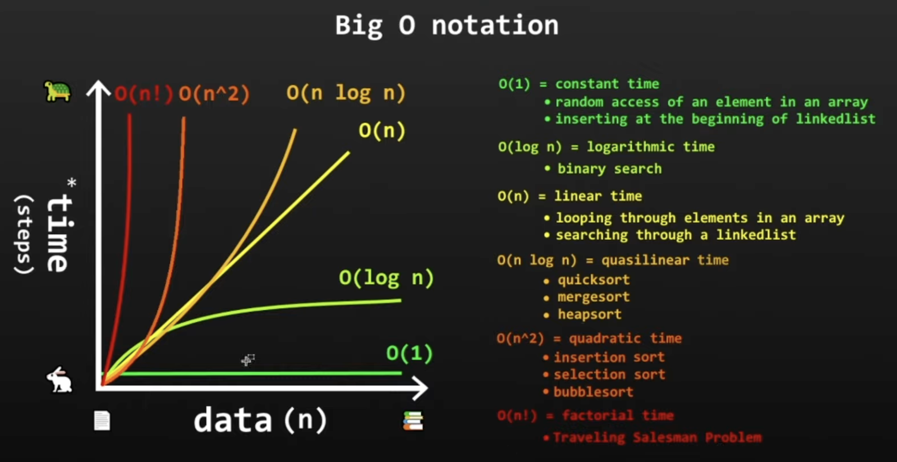

# jsd12_week_14_myDSA

# Data Structures and Algorithms (DSA) Research

Repo นี้เป็นโน้ตสรุปความเข้าใจเบื้องต้นเกี่ยวกับ **Data Structures and Algorithms (DSA)**  
หัวข้อที่ศึกษาในครั้งนี้ ได้แก่

1. Sorting  
2. Binary Search  
3. BFS and DFS  
4. Time Complexity / Big-O Notation  

---

## DSA คืออะไร?

**Data Structures and Algorithms (DSA)** คือพื้นฐานสำคัญของการเขียนโปรแกรม

- **Data Structures** คือ วิธีการจัดเก็บข้อมูล เช่น Array, Object, Stack, Queue, Tree, Graph
- **Algorithms** คือ ขั้นตอนหรือวิธีแก้ปัญหา เช่น การเรียงข้อมูล การค้นหาข้อมูล หรือการเดินสำรวจข้อมูล

การเรียน DSA ช่วยให้เราเขียนโค้ดได้เป็นระบบขึ้น และเลือกวิธีแก้ปัญหาที่เหมาะสมกับข้อมูลมากขึ้น

---

## 1. Sorting

### Sorting คืออะไร?

**Sorting** คือการเรียงข้อมูลให้อยู่ในลำดับที่ต้องการ เช่น

- เรียงจากน้อยไปมาก
- เรียงจากมากไปน้อย
- เรียงตามตัวอักษร A-Z
- เรียงตามวันที่
- เรียงตามคะแนนหรือราคา

### ตัวอย่างการใช้งานจริง

ในเว็บหรือแอปพลิเคชัน เราอาจใช้ Sorting ในหลายสถานการณ์ เช่น

- เรียงราคาสินค้าจากถูกไปแพง
- เรียงสินค้าล่าสุด
- เรียงคะแนนรีวิว
- เรียงรายชื่อนักเรียนตามตัวอักษร
- เรียงรายการคำสั่งซื้อตามวันที่

### ตัวอย่างใน JavaScript

```js
const prices = [300, 100, 500, 200];

prices.sort((a, b) => a - b);

console.log(prices);
// [100, 200, 300, 500]
```

ในตัวอย่างนี้ เราใช้ `.sort()` เพื่อเรียงตัวเลขจากน้อยไปมาก

### คำสำคัญ

- `sort` = เรียงข้อมูล
- `ascending` = เรียงจากน้อยไปมาก
- `descending` = เรียงจากมากไปน้อย
- `compare` = เปรียบเทียบค่า

---

## 2. Binary Search

### Binary Search คืออะไร?

**Binary Search** คือ algorithm สำหรับค้นหาข้อมูลใน array ที่เรียงลำดับแล้ว  
โดยใช้วิธี **แบ่งครึ่งช่วงที่ค้นหาไปเรื่อย ๆ**

จุดสำคัญคือ Binary Search จะใช้ได้ดีก็ต่อเมื่อข้อมูลถูกเรียงลำดับไว้แล้ว

### เงื่อนไขสำคัญ

ก่อนใช้ Binary Search ข้อมูลต้องเป็น **sorted array** หรือ array ที่เรียงแล้ว

ตัวอย่าง array ที่เรียงแล้ว:

```js
const numbers = [1, 3, 5, 7, 9, 11];
```

### ตัวอย่างแนวคิด

ถ้าต้องการหาเลข `9` จาก array นี้

```js
[1, 3, 5, 7, 9, 11]
```

Binary Search จะทำงานประมาณนี้:

1. ดูค่าตรงกลางก่อน
2. ถ้าค่าตรงกลางน้อยกว่าเลขที่ต้องการ ให้ตัดฝั่งซ้ายทิ้ง
3. ถ้าค่าตรงกลางมากกว่าเลขที่ต้องการ ให้ตัดฝั่งขวาทิ้ง
4. ทำซ้ำจนกว่าจะเจอค่าที่ต้องการ

### ข้อดีของ Binary Search

Binary Search เร็วกว่าการค้นหาแบบไล่ทีละตัว เพราะทุกครั้งที่ค้นหา จะตัดข้อมูลออกได้ประมาณครึ่งหนึ่ง

### Time Complexity

```text
O(log n)
```

เพราะข้อมูลถูกแบ่งครึ่งไปเรื่อยๆ

### คำสำคัญ

- `sorted array` = array ที่เรียงลำดับแล้ว
- `left` = ขอบซ้ายของช่วงที่กำลังค้นหา
- `right` = ขอบขวาของช่วงที่กำลังค้นหา
- `mid` หรือ `middle` = ตำแหน่งตรงกลาง
- `target` = ค่าที่ต้องการค้นหา

---

## 3. BFS and DFS

BFS และ DFS เป็น algorithm ที่ใช้สำหรับค้นหาหรือสำรวจข้อมูลในโครงสร้างแบบ **Tree** หรือ **Graph**

ก่อนเข้าใจ BFS และ DFS ควรรู้คำพื้นฐานก่อน:

- **Node** = จุดหรือข้อมูลแต่ละตัว
- **Edge** = เส้นที่เชื่อมระหว่าง node
- **Graph** = โครงสร้างข้อมูลที่มี node และ edge เชื่อมกัน
- **Tree** = โครงสร้างข้อมูลแบบลำดับชั้น คล้ายต้นไม้

---

## BFS

### BFS คืออะไร?

**BFS** ย่อมาจาก **Breadth-First Search**  
เป็นการค้นหาแบบ **กว้างก่อน** หรือค้นหาทีละชั้น

BFS จะเริ่มจากจุดเริ่มต้น แล้วดู node ที่อยู่ใกล้ก่อน จากนั้นค่อยๆ ขยายออกไปยัง node ที่อยู่ไกลขึ้น

### ภาพจำง่ายๆ

BFS เหมือนการค้นหาแบบ “วงกระจายออกไปทีละชั้น”  
เริ่มจากจุดใกล้ที่สุดก่อน แล้วค่อยไปจุดที่ไกลขึ้น

### BFS มักใช้กับ

- การหาเส้นทางที่สั้นที่สุดใน graph แบบพื้นฐาน
- การค้นหาเพื่อนของเพื่อนใน social network
- การสำรวจข้อมูลทีละระดับ
- การหาว่า node หนึ่งเชื่อมถึงอีก node หนึ่งไหม

### Data Structure ที่ใช้

BFS มักใช้ **Queue**

Queue คือโครงสร้างข้อมูลแบบ **เข้าก่อน ออกก่อน**  
หรือ First In, First Out (FIFO)

---

## DFS

### DFS คืออะไร?

**DFS** ย่อมาจาก **Depth-First Search**  
เป็นการค้นหาแบบ **ลึกก่อน**

DFS จะเลือกเส้นทางหนึ่งแล้วเดินลงไปให้สุดก่อน ถ้าไปต่อไม่ได้จึงย้อนกลับมาเลือกเส้นทางอื่น

### ภาพจำง่ายๆ

DFS เหมือนการเดินเข้าทางหนึ่งไปให้สุดก่อน  
ถ้าตันแล้วค่อยถอยกลับมาลองทางใหม่

### DFS มักใช้กับ

- การสำรวจเส้นทางทั้งหมด
- การเช็คว่ามีทางจากจุดหนึ่งไปอีกจุดหนึ่งหรือไม่
- การทำงานกับ tree หรือ graph
- การแก้ปัญหาที่ใช้ recursion

### Data Structure ที่ใช้

DFS มักใช้ **Stack** หรือ **Recursion**

Stack คือโครงสร้างข้อมูลแบบ **เข้าทีหลัง ออกก่อน**  
หรือ Last In, First Out (LIFO)

---

## เปรียบเทียบ BFS และ DFS

| หัวข้อ | BFS | DFS |
|---|---|---|
| วิธีค้นหา | ค้นหาแบบกว้างก่อน | ค้นหาแบบลึกก่อน |
| ลักษณะการเดิน | ไล่ทีละชั้น | ไปให้สุดทางก่อน |
| Data Structure | Queue | Stack หรือ Recursion |
| เหมาะกับ | หาเส้นทางสั้นที่สุดแบบพื้นฐาน | สำรวจทุกเส้นทาง |
| ภาพจำ | กระจายออกเป็นชั้น ๆ | เดินลึกไปทางเดียวก่อน |

### คำสำคัญ

- `BFS`
- `DFS`
- `graph`
- `tree`
- `node`
- `edge`
- `queue`
- `stack`
- `recursion`

---

## 4. Time Complexity / Big-O Notation

### Big-O คืออะไร?

**Big-O Notation** คือวิธีอธิบายประสิทธิภาพของ algorithm  
โดยดูว่าเมื่อจำนวนข้อมูลเพิ่มขึ้น algorithm จะใช้เวลาเพิ่มขึ้นมากแค่ไหน

พูดง่าย ๆ คือ Big-O ช่วยให้เราประเมินได้ว่าโค้ดของเราจะเร็วหรือช้าเมื่อข้อมูลมีขนาดใหญ่ขึ้น

---

## ภาพตัวอย่าง Big-O


*Image source: [Recommended YouTube video from class](https://www.youtube.com/watch?v=XMUe3zFhM5c)*

ภาพนี้แสดงให้เห็นว่า algorithm แต่ละแบบใช้เวลาเพิ่มขึ้นไม่เท่ากัน เมื่อจำนวนข้อมูลเพิ่มขึ้น

---

## ตัวอย่าง Big-O ที่พบบ่อย

| Big-O | ความหมาย | ตัวอย่าง |
|---|---|---|
| `O(1)` | ใช้เวลาคงที่ | การเข้าถึงข้อมูลใน array ด้วย index |
| `O(log n)` | เวลาเพิ่มขึ้นช้า เพราะแบ่งครึ่งข้อมูล | Binary Search |
| `O(n)` | เวลาเพิ่มขึ้นตามจำนวนข้อมูล | การวน loop ผ่าน array |
| `O(n log n)` | เร็วกว่าการวนซ้อนหลายแบบ มักเจอใน sorting ที่ดี | Merge Sort, Quick Sort |
| `O(n²)` | เวลาเพิ่มขึ้นมากเมื่อข้อมูลเยอะ | loop ซ้อน loop |
| `O(n!)` | ช้ามากเมื่อข้อมูลเพิ่มขึ้น | Traveling Salesman Problem บางวิธี |

---

## ตัวอย่าง O(1)

```js
const fruits = ["apple", "banana", "orange"];

console.log(fruits[0]);
```

โค้ดนี้เป็น `O(1)` เพราะไม่ว่า array จะมีข้อมูลกี่ตัว การเข้าถึง index เดิมก็ใช้เวลาคงที่

---

## ตัวอย่าง O(n)

```js
const fruits = ["apple", "banana", "orange"];

for (let fruit of fruits) {
  console.log(fruit);
}
```

โค้ดนี้เป็น `O(n)` เพราะต้องวนตามจำนวนข้อมูลใน array

ถ้ามีข้อมูล 3 ตัว ก็วน 3 รอบ  
ถ้ามีข้อมูล 100 ตัว ก็วน 100 รอบ

---

## ตัวอย่าง O(n²)

```js
const numbers = [1, 2, 3];

for (let i of numbers) {
  for (let j of numbers) {
    console.log(i, j);
  }
}
```

โค้ดนี้เป็น `O(n²)` เพราะมี loop ซ้อน loop  
ถ้าข้อมูลเยอะขึ้น จำนวนรอบการทำงานจะเพิ่มขึ้นมาก

---

## สรุปความเข้าใจ

จากการศึกษาเบื้องต้น DSA เป็นพื้นฐานที่ช่วยให้เราเขียนโปรแกรมเพื่อแก้ปัญหาได้ดีขึ้น

- **Sorting** ใช้สำหรับเรียงข้อมูลให้อยู่ในลำดับที่ต้องการ
- **Binary Search** ใช้สำหรับค้นหาข้อมูลที่เรียงแล้วได้อย่างรวดเร็ว
- **BFS** ใช้สำหรับค้นหาหรือสำรวจข้อมูลแบบกว้างก่อน
- **DFS** ใช้สำหรับค้นหาหรือสำรวจข้อมูลแบบลึกก่อน
- **Big-O** ใช้อธิบายว่า algorithm มีประสิทธิภาพแค่ไหนเมื่อจำนวนข้อมูลเพิ่มขึ้น

สิ่งที่ควรฝึกต่อคือการลองทำโจทย์ง่ายๆ ใน LeetCode เพื่อให้เข้าใจ pattern ของ algorithm แต่ละแบบมากขึ้น

---

## Resources

- LeetCode: https://leetcode.com/
- https://www.youtube.com/watch?v=XMUe3zFhM5c
- https://www.youtube.com/watch?v=g2o22C3CRfU
